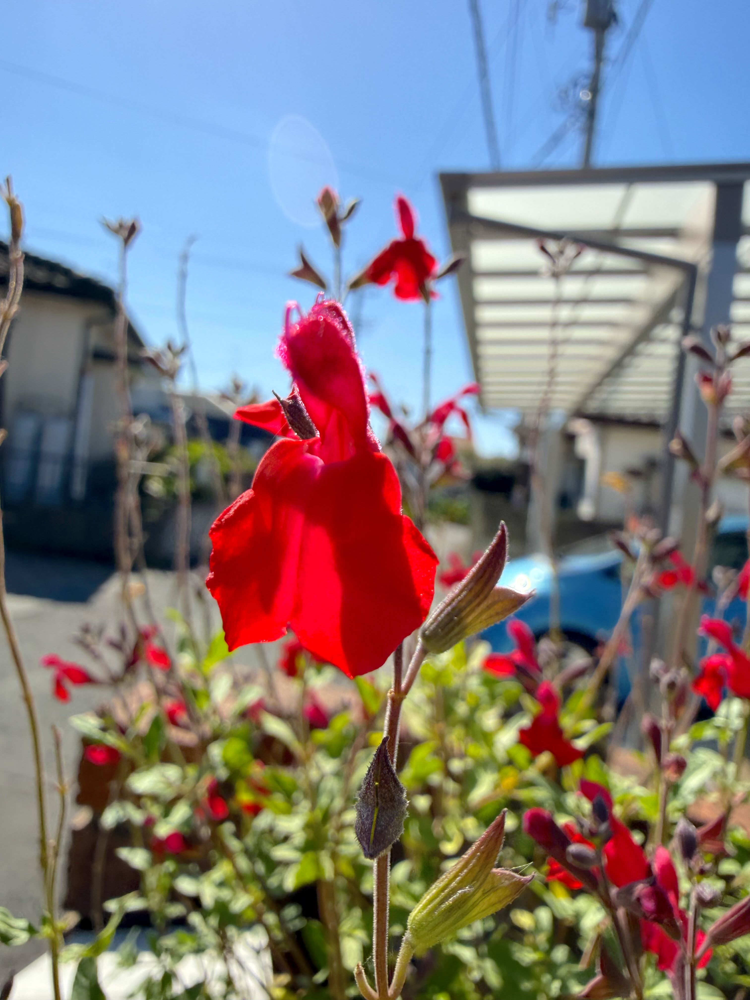
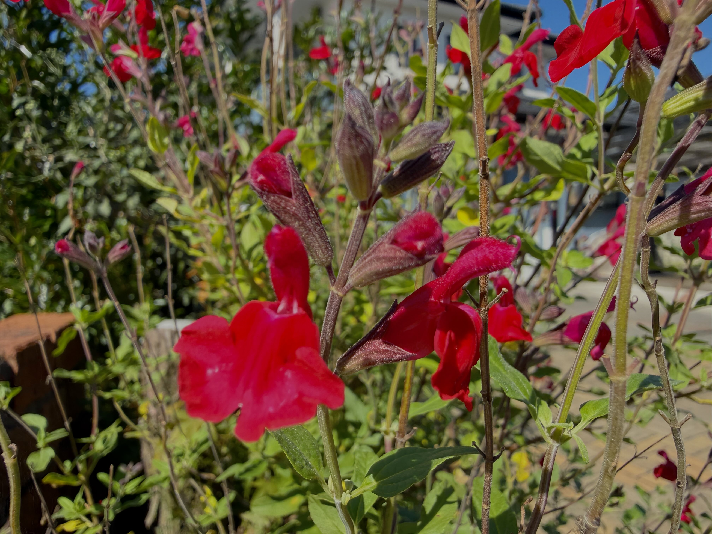
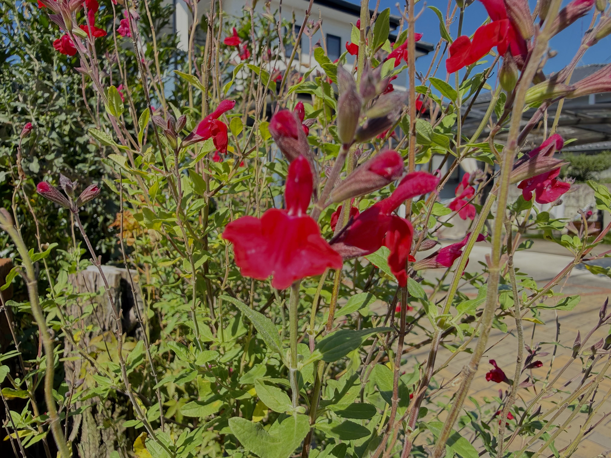
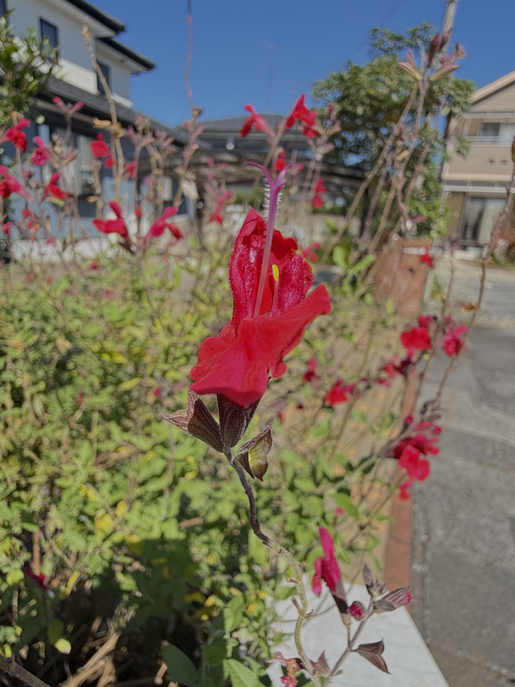
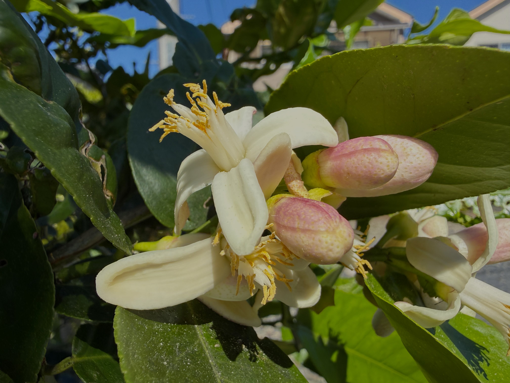
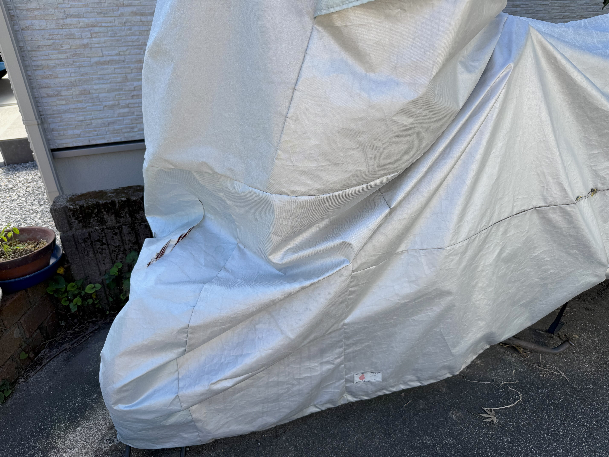
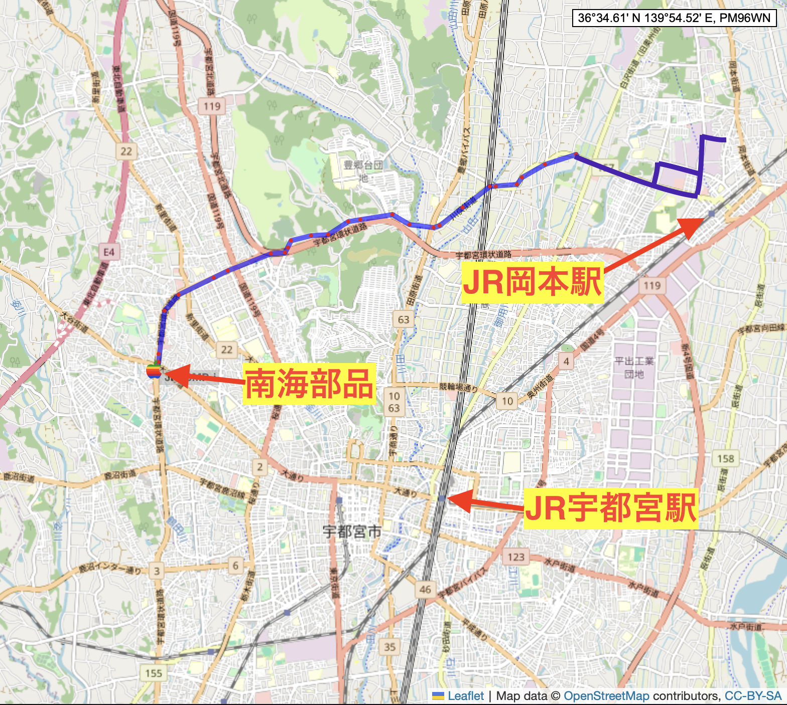

# 20261009_utsunomiya
<html lang="ja" data-loaded="false" data-scrolled="false" data-spmenu="closed">
<head>

<meta charset="UTF-8">
<meta http-equiv="Content-Type" content="text/html; charset=UTF-8">
<meta http-equiv="X-UA-Compatible" content="IE=EmulateIE10" />
<meta http-equiv="X-UA-Compatible" content="IE=edge">

<meta name="viewport" content="width=device-width, initial-scale=1.0">

<!--ここから上はお決まりの定型文です-->

<!--ここからが表現の書式などを決めるcssという部分-->

<link href="https://cdnjs.cloudflare.com/ajax/libs/lightbox2/2.7.1/css/lightbox.css" rel="stylesheet">

</head>

<body>

<!-- オープニング（スプラッシュ画面に写真とタイトルを配置） -->

  

    
    
最初の一枚はピンクの薔薇

  

<!-- メインコンテンツ -->

  <h1>メインのホームページ画像</h1>
  

<!--
    
<a href="https://peyng.github.io/restart/">前回までの記録</a>><a>今回2026,05,28</a>

-->

モバイル端末をお使いの場合は、画面を横向きにすると
背景画像の横方向がご覧頂けます。

<!--ここ上は、ほぼそのまま使います！-->

<!--QRコードの挿入例-->

 QR for Access

<marquee direction="left" scrollamount="20" width="30%">(^_^)/~alis</marquee>

<!--流れ文字の挿入例-->
<h1><marquee behavior="left">!!! 2026/10/09、庭のお花達とバイクカバー交換から、田んぼの社とスーパーのお花達まで !!!</marquee></h1>

                          

<!--ここから下が、本体部分-->

<h2>2026Oct08、青空バックに庭のサルビアがニッコリこんにちは！</h2>

<h2>みかんのお花も元気に満開</h2>

<h2>バイクのカバーが古くなったので、交換します</h2>

<h2>バイク用品は宇都宮の南海部品</h2>

<h2>バイクカバーはこんなに有ります</h2>

<h2>購入したのはこちらのカバー、¥17,380-でした</h2>

<h2>色は銀から黒へ</h2>

<h2>田んぼの向こうには那須連山がクッキリ</h2>

<h2>実りの秋を田んぼの中の社に感謝</h2>

<h2>社への参道にもお花が咲いています</h2>

<h2>田んぼの中の社に夕陽が当たりました</h2>

<h2>スーパーのお花達も元気に満開</h2>

<h2>晩御飯はお肉と野菜</h2>

<h2>南海部品までの移動経路はこんな感じ</h2>

<h2>移動中の走行動画</h2>

<iframe width="560" height="315" src="https://www.youtube.com/embed/72VL5dnAdYc?si=gkduUQ2qRQko5AtJ&autoplay=1&mute=1&loop=1&playlist=72VL5dnAdYc" title="YouTube video player" frameborder="0" allow="accelerometer; autoplay; clipboard-write; encrypted-media; gyroscope; picture-in-picture" allowfullscreen></iframe>
    

  

  

<h2>今日のBGMは、懐かしい道を行く｜あの頃を思い出すケルト音楽｜Relaxing Celtic Music｜癒しBGM　作業用BGM　リラックスBGM🍋</h2>

<iframe width="560" height="315" src="https://www.youtube.com/embed/EVkIXJIO0s0?si=jRnyZxlFVv9oW_3i" title="YouTube video player" frameborder="0" allow="accelerometer; autoplay; clipboard-write; encrypted-media; gyroscope; picture-in-picture; web-share" referrerpolicy="strict-origin-when-cross-origin" allowfullscreen></iframe>
    

   
<h2>2026Oct09、庭のお花達とバイクカバー交換から、田んぼの社とスーパーのお花達まででした Thank you for reading this far.</h2>

   

<!-- hitwebcounter Code START -->
<a href="https://www.hitwebcounter.com" target="_blank">

you are visitor The numbers are cumulative for the Bangkok ＆ Utsunomiya series websites launched since 2025 August 1st.
</a>  

         

  

      

<!--本体はここまで-->
    

<!--画面に空白地帯を作って、背景が見えるようにしています-->
                                              

<!-- フッタ -->
<footer>

Copyright 2026/10/09 alis

</footer>

<!--HPにさまざまなJavaScriptを呼び込むための書式-->

    </body>
    
</html>
